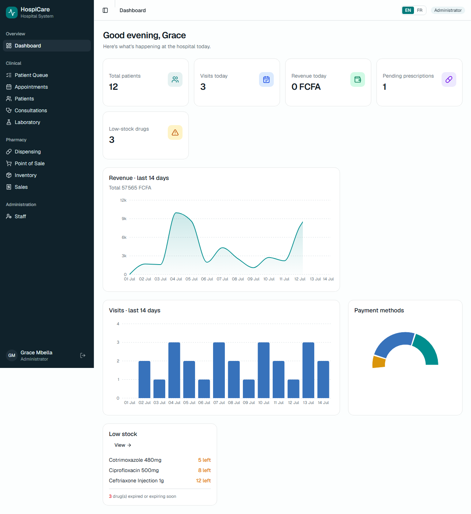
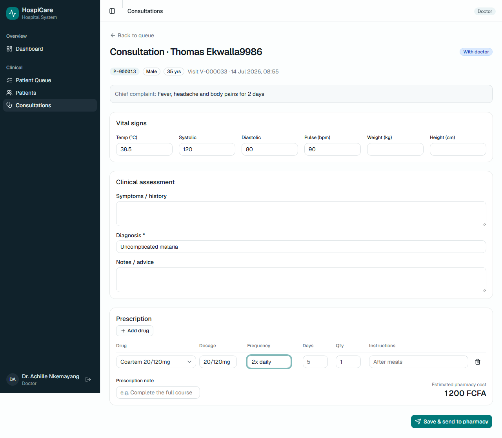
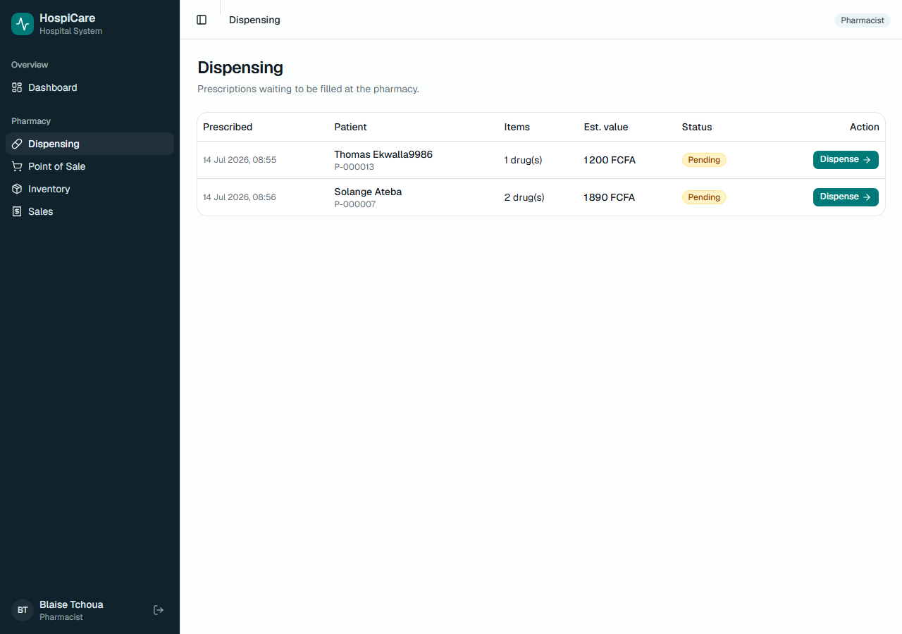
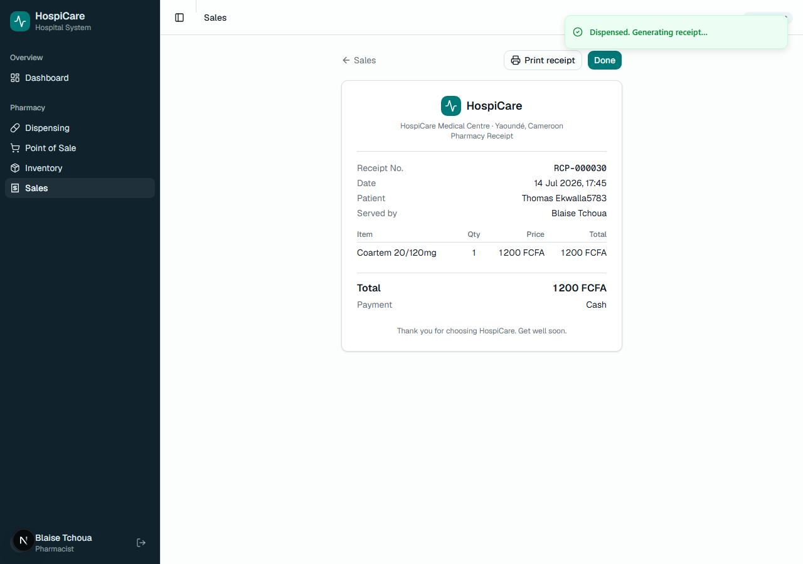
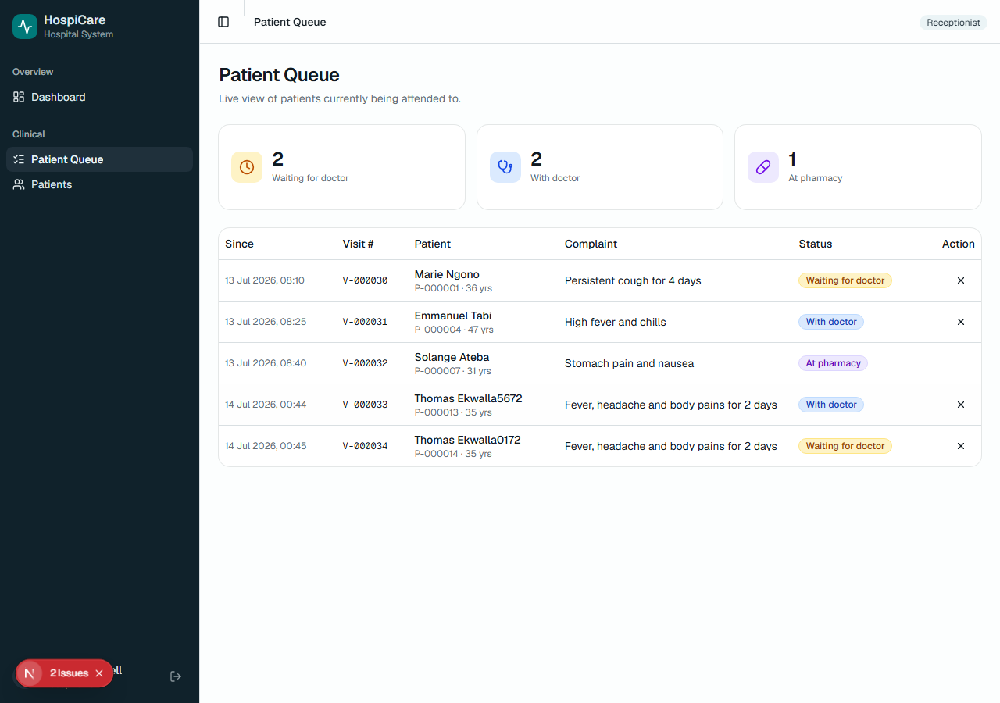
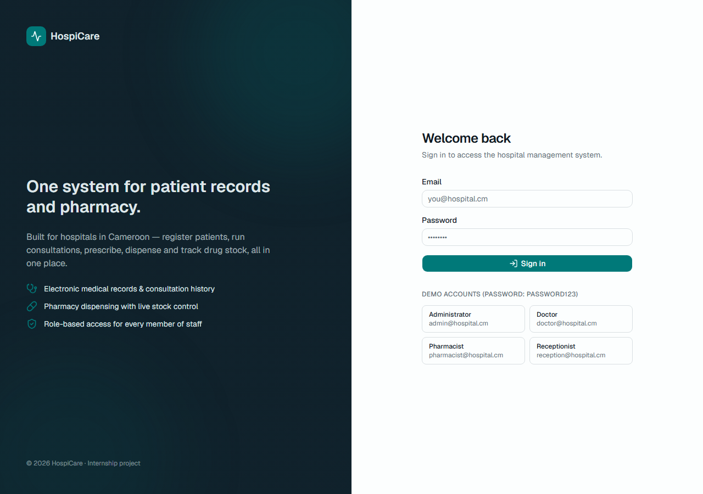
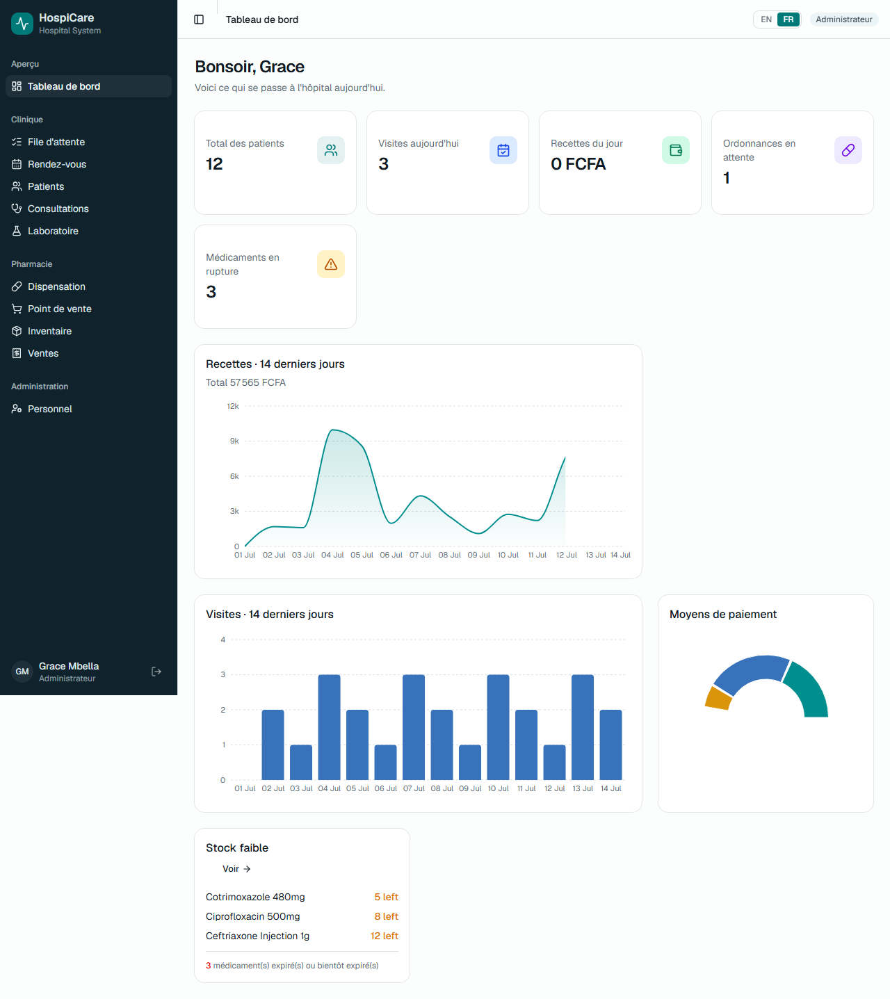
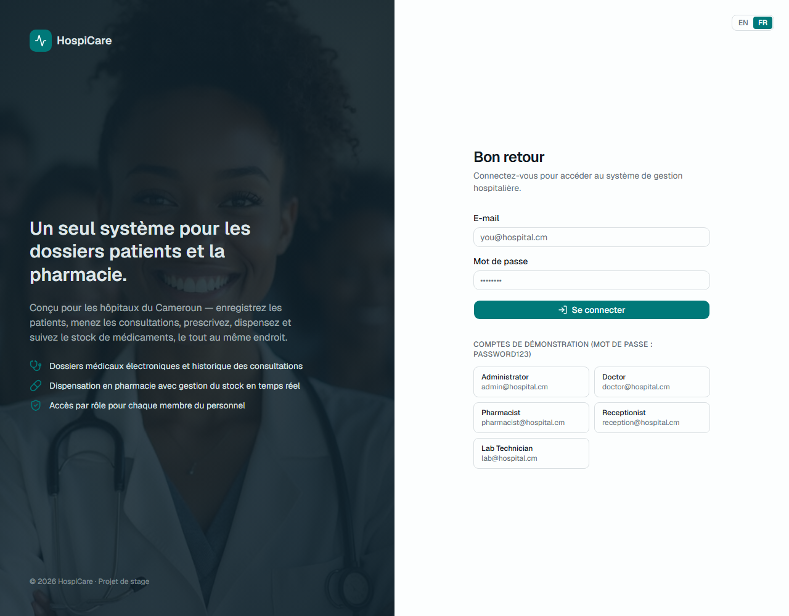

# HospiCare — Hospital Management System (EMR + Pharmacy)

A hospital management system built for the Cameroonian context, covering the
two daily pain points of a district hospital: **electronic medical records
(EMR)** and **pharmacy management**. One patient flows through the whole
system — reception → doctor → pharmacy — with every action persisted and
connected.

> Internship project. Built with Next.js, Prisma and PostgreSQL/SQLite.

---

## Screenshots

<table>
<tr>
<td width="50%"><br><b>Admin dashboard</b> — role-aware KPIs, revenue &amp; visit charts, payment mix, low-stock</td>
<td width="50%"><br><b>Doctor consultation</b> — vitals, diagnosis and live prescription builder</td>
</tr>
<tr>
<td width="50%"><br><b>Pharmacy dispensing</b> — prescriptions waiting to be filled</td>
<td width="50%"><br><b>Printable receipt</b> — generated after dispensing, in FCFA</td>
</tr>
<tr>
<td width="50%"><br><b>Patient queue</b> — live board of who is waiting, with the doctor, or at pharmacy</td>
<td width="50%"><br><b>Login</b> — role-based access for every member of staff</td>
</tr>
<tr>
<td width="50%"><br><b>Bilingual</b> — the same dashboard in French (full FR / EN toggle)</td>
<td width="50%"><br><b>French login</b> — Cameroon is officially bilingual</td>
</tr>
</table>

---

## Features

The system has four staff roles, each with its own view and permissions.

| Role | Can do |
| --- | --- |
| **Receptionist** | Register patients, book appointments, start visits (add to the doctor queue) |
| **Doctor** | Attend to waiting patients, record vitals & diagnosis, write prescriptions, order lab tests |
| **Pharmacist** | Dispense prescriptions, manage drug inventory, sell over the counter, print receipts |
| **Lab Technician** | Process ordered lab tests and enter results |
| **Administrator** | Everything above + staff management + full analytics |

**Core capabilities**
- 🔐 Secure authentication with **role-based access control** (enforced server-side)
- 👤 **Patient records** — register, search, full profile with visit history, allergy alerts and **vitals trends**
- 📅 **Appointments** — book future visits and check patients in to the queue
- 🩺 **Consultations** — vitals, diagnosis, a live **prescription builder**, **lab test ordering**, and **printable prescriptions**
- 🔬 **Laboratory** — doctors order tests, the lab enters results, results shown on the consultation
- 💊 **Pharmacy** — dispense against prescriptions with **automatic stock deduction**,
  a full **auditable stock ledger**, **low-stock & expiry alerts**, walk-in point of sale,
  and **printable receipts**
- 📊 **Dashboard** — role-aware KPIs and charts (revenue, visits, payment mix, low stock)
- 🌍 **Bilingual** — full **French / English** interface (Cameroon is officially bilingual)
- 🇨🇲 **Cameroon context** — amounts in **FCFA** (integer money, no rounding bugs),
  **Cash / MTN Mobile Money / Orange Money** payments, Cameroonian regions

---

## Tech stack

- **Next.js 16** (App Router, Server Components, Server Actions) + **React 19** + **TypeScript**
- **Prisma 6** ORM — SQLite in development, PostgreSQL in production (portable schema)
- **Auth.js (NextAuth v5)** — credentials auth, JWT sessions, edge middleware guard
- **Tailwind CSS 4** + **shadcn/ui** (Base UI) — professional, accessible component system
- **Recharts** — dashboard visualisations
- **Zod** — end-to-end input validation

---

## Data model (overview)

```
User ──< Patient ──< Visit ──1 Consultation ──1 Prescription ──< PrescriptionItem >── Drug
                        │                                                              │
                        └──────────< Sale >── SaleItem ───────────────────────────────┘
                                                     Drug ──< StockMovement (audit ledger)
```

- **Money** is stored as integers in FCFA (the CFA franc has no minor unit).
- **Stock** is never changed blindly — every movement (purchase, dispense,
  adjustment) is written to `StockMovement`, giving a complete audit trail.

---

## Getting started

```bash
# 1. Install dependencies
npm install

# 2. Set up the database (creates dev.db + runs migrations)
npx prisma migrate dev

# 3. Load realistic demo data
npm run db:seed

# 4. Run the app
npm run dev
```

Open http://localhost:3000.

### Demo accounts (password: `password123`)

| Email | Role |
| --- | --- |
| `admin@hospital.cm` | Administrator |
| `doctor@hospital.cm` | Doctor |
| `pharmacist@hospital.cm` | Pharmacist |
| `reception@hospital.cm` | Receptionist |

---

## Useful scripts

| Command | Description |
| --- | --- |
| `npm run dev` | Start the development server |
| `npm run build` | Production build (type-checks the whole app) |
| `npm run db:seed` | Reset & load demo data |
| `npm run db:studio` | Open Prisma Studio (browse the database) |
| `npm run db:migrate` | Create/apply a migration |
| `node scripts/e2e.js` | Run the end-to-end workflow test (requires the dev server) |

---

## Try the full workflow

1. **Reception** (`reception@hospital.cm`) → Patients → *Register patient* → open the
   profile → *Start visit*.
2. **Doctor** (`doctor@hospital.cm`) → Patient Queue → *Attend* → record vitals &
   diagnosis → add a drug to the prescription → *Save & send to pharmacy*.
3. **Pharmacist** (`pharmacist@hospital.cm`) → Dispensing → *Dispense* → *Confirm* →
   a receipt is generated, stock is reduced, and the visit is completed.
4. **Admin** (`admin@hospital.cm`) → Dashboard to see it reflected in the analytics.

---

## Architecture notes

- **Server-side access control.** The navigation only *hides* links a role can't
  use; every protected page and every server action independently calls
  `requireRole(...)`, so access is truly enforced, not just visually hidden.
- **Transactions.** Dispensing runs inside a database transaction: it checks
  stock, records the sale, writes ledger entries, updates the prescription and
  completes the visit — all atomically.
- **Portable schema.** "Enum-like" fields are stored as strings and validated by
  Zod, so the exact same schema runs on SQLite (dev) and PostgreSQL (prod).

## Future work

Scoped out of this version but designed for:
- **Telemedicine** — remote consultations for patients who can't travel
- **Public website & online appointment booking**
- Laboratory & imaging orders, billing / insurance (CNAM), SMS reminders
- Offline-first support for areas with unreliable connectivity
